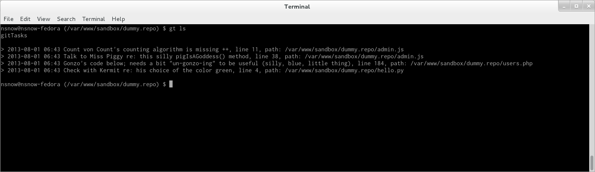

# gitTasks

## What is it?
**gitTasks** is a simple program to create task lists from within your codebase.

#### Show tasks in concise view

#### Show tasks in verbose view

#### Search tasks for 'piggy'

## Why?
In order to keep track of things I need to do within my codebase, I've often put in `@TODO` in a comment directly in the file. Then, when I need to find out what my tasks were, I'd do a search on the entire directory (either in Sublime or via the command line) for `@TODO`. However, I never knew when I originally put the task in the codebase or a way to keep track of all those tasks, even after I deleted them from the repository. **gitTasks** was my naive attempt to solve this problem.

## Requirements
* Python 2.7+

gitTasks has been tested with Python 2.7.3. As of this writing, it is not compatible with 3.0+ just yet.

## Install

First, save `gittasks.py` into whatever directory you'd like. I place it in a `~/utils/` directory.

Secondly, in your git repository, if you don't have a `pre-commit` file in the `.git/hooks/` folder, create one.

Next, inside the `pre-commit` file, add the following:

    #!/bin/sh
    python /path/to/gittasks.py

Finally, run the following from the command line:

    $ chmod u+x /path/to/gittasks.py
    $ chmod u+x .git/hooks/pre-commit

All done!

## Usage

### Alias
I create an alias for `gt` in my `.bashrc` file:

    alias gt='python /path/to/gittasks.py'

### Help
Run `gt -h` for help:

    $ gt -h
    usage: gittasks.py [-h] [-i IDENTIFIER] [-s TERM] [-v] [-l] [-c "TASK"]

    Manage task lists from a repository.

    optional arguments:
      -h, --help            show this help message and exit
      -i IDENTIFIER, --identifier IDENTIFIER
                            Set the gitTasks identifier
      -s TERM, --search TERM
                            Simple text search performed on all tasks
      -v, --verbose         Run in verbose mode
      -l, --list            Display a task list; defaults to concise view
      -c "TASK", --create "TASK"
                            Create a new task

### Create a task
There are two ways to create a task:

##### Tasks in the codebase
Place `@gt` anywhere in your code. It doesn't matter what characters you use to comment the task out, so `// @gt` and `# @gt` will be the same.

    # @gt This is your comment or

    // @gt Here's another comment

##### Tasks via command line
Run the following:

    $ gt -c "This is a task"
    $ gt --create "This is another task"

### Save tasks
When you run `git commit -m "Commit message"`, the `pre-commit` kicks in and runs the script with no arguments. If this is the first time the script has been run on this repo, the entire repository will be checked for `@gt` occurrences and placed into a `.gittasks` file at the root of your repo.

Otherwise, `git diff HEAD` is run from the script, which picks up any changes between that and the tasks in the `.gittasks` file. Tasks no longer present are marked as completed.

Or, you can run the following on any repository:

    $ python /path/to/gittasks.py

### Show tasks
Pass the `-l` or `--list` flag to the script. The `-d` flag shows a concise task list with `task, line number, file path` and only displays uncompleted tasks.

    $ python /path/to/gittasks.py [-l|--list]

### Show all tasks
Pass the `-v|--verbose` flag to the script, along with the `-d` flag, to display all tasks, whether they are incomplete or not. If the task is completed, the date and time that it was completed on is displayed. Otherwise, the date the task was first added to the list is displayed.

    $ python /path/to/gittasks.py [-d|--display] [-v|--verbose]

### Search tasks
Pass the `-s` or `--search` flag with a term following. You may use the `-v` flag to have more information returned. However, the term is searched for regardless if the task is complete or not.

    $ python /path/to/gittasks.py [-s|--search] term -v

### Set gitTask identifier
By default, the gitTask identifier used to identify tasks within your codebase is `@gt`. This can be changed though by add the `-i` or `--identifier` flag, followed by the string you want to use in your codebase. If you want to use a different identifier, you'll need to add this flag to the python script line in the `.git/hooks/pre-commit` file.

    $ python /path/to/gittasks.py [i|--identifier] @identifier

## Uninstall
Just delete the `gittasks.py` file and remove the call to the script from each repository's `.git/hooks/pre-commit` file.

## Bugs
Submit a [new issue](https://github.com/nikkisnow/gitTasks/issues/new) detailing the issue. Or, feel free to contribute by opening a [pull request](https://github.com/nikkisnow/gitTasks/pulls).

## License
Copyright (c) 2013, Nikki Snow

Permission is hereby granted, free of charge, to any person obtaining a copy
of this software and associated documentation files (the "Software"), to deal
in the Software without restriction, including without limitation the rights
to use, copy, modify, merge, publish, distribute, sublicense, and/or sell
copies of the Software, and to permit persons to whom the Software is
furnished to do so, subject to the following conditions:

The above copyright notice and this permission notice shall be included in
all copies or substantial portions of the Software.

THE SOFTWARE IS PROVIDED "AS IS", WITHOUT WARRANTY OF ANY KIND, EXPRESS OR
IMPLIED, INCLUDING BUT NOT LIMITED TO THE WARRANTIES OF MERCHANTABILITY,
FITNESS FOR A PARTICULAR PURPOSE AND NONINFRINGEMENT. IN NO EVENT SHALL THE
AUTHORS OR COPYRIGHT HOLDERS BE LIABLE FOR ANY CLAIM, DAMAGES OR OTHER
LIABILITY, WHETHER IN AN ACTION OF CONTRACT, TORT OR OTHERWISE, ARISING FROM,
OUT OF OR IN CONNECTION WITH THE SOFTWARE OR THE USE OR OTHER DEALINGS IN
THE SOFTWARE.